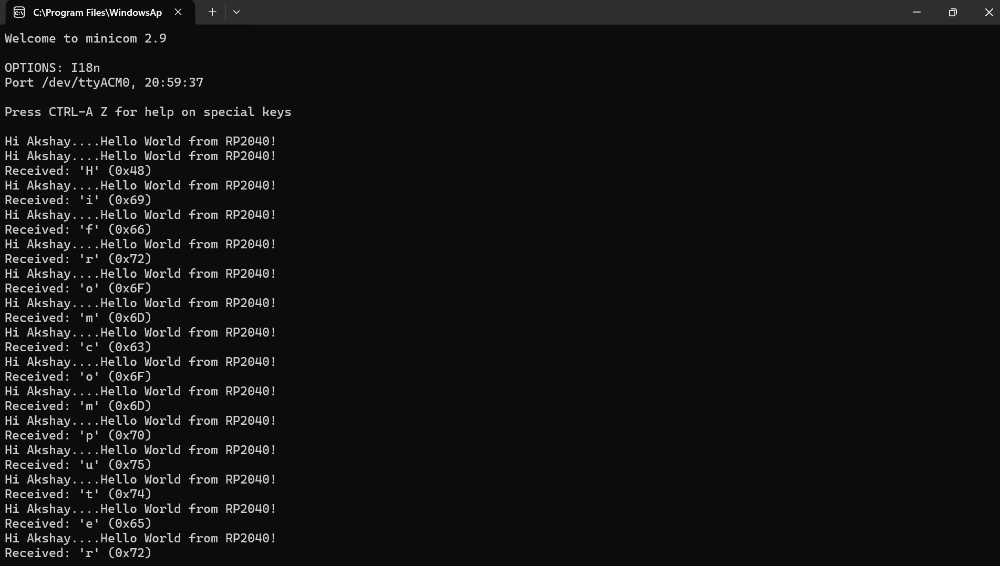

# Hello World over USB CDC & UART — Raspberry Pi Pico (RP2040)

<p align="center">
  <strong>Raspberry Pi Pico · RP2040 · USB CDC · UART0 · Pico SDK · WSL</strong>
</p>

A mini-project demonstrating serial communication from an RP2040 using the official Pico SDK on Linux (running inside WSL2 on Windows 11).

The firmware sends a periodic message over both the USB CDC interface and the hardware UART0, and echoes back any characters received from the host computer.

> **Note on UART:** The UART backend is enabled and compiled into the firmware, and the code path is exercised by the same `printf()` call. However, physical UART verification was **not performed** because a USB-to-UART adapter and jumper wires were not available at the time of submission. The UART configuration is documented in the code and in this README for completeness.

---

## Contents

- [Objective](#1-objective)
- [Hardware Used](#2-hardware-used)
- [Software Stack](#3-software-stack)
- [Project Structure](#4-project-structure)
- [How It Works](#5-how-it-works)
- [Build Instructions](#6-build-instructions)
- [Flash Instructions](#7-flash-instructions)
- [Viewing Output with MiniCom](#8-viewing-output-with-minicom)
- [Result](#9-result)
- [Challenges Faced & How They Were Solved](#10-challenges-faced--how-they-were-solved)
- [Lessons Learned](#11-lessons-learned)
- [Optional Enhancement](#12-optional-enhancement--receiving-data-from-the-computer)
- [References](#13-references)

---

## 1. Objective

Write a program for the Raspberry Pi Pico (RP2040) that:
1. Outputs the string `Hi Akshay....Hello World from RP2040!` once per second over USB CDC and hardware UART0.
2. (Optional Enhancement) Receives data from the host computer and echoes it back.

View the output on the host machine using **MiniCom**.

---

## 2. Hardware Used

| Component              | Notes                                          |
|------------------------|------------------------------------------------|
| Raspberry Pi Pico      | RP2040, with micro-USB connector               |
| Micro-USB **data** cable | Must be a data cable, not a power-only cable |
| Host laptop            | Windows 11 with WSL2 (Ubuntu 24.04)            |


---

## 3. Software Stack

| Component              | Version / Source                                |
|------------------------|-------------------------------------------------|
| Pico SDK               | `~/pico-sdk` (cloned from GitHub)               |
| ARM GCC toolchain      | `arm-none-eabi-gcc` 13.2.1                      |
| CMake                  | ≥ 3.13                                          |
| Build tools            | `make`, `git`, `python3`                        |
| WSL2                   | Ubuntu 24.04 on Windows 11                      |
| USB passthrough        | `usbipd-win` (v4.x) on Windows                  |
| Terminal emulator      | MiniCom (`sudo apt install minicom`)            |

---

## 4. Project Structure

```
Mini_Project/
├── CMakeLists.txt
├── hello_uart_usb.c
├── pico_sdk_import.cmake
├── README.md
└── screenshots
    └── minicom_output.png
```
---

## 5. How It Works

The Pico SDK provides a unified `stdio` framework. When both USB and UART
backends are enabled at build time, a single `printf()` writes to **all**
enabled backends simultaneously.

### 5.1 `hello_uart_usb.c` (with Optional Enhancement)

```cc
#include <stdio.h>
#include "pico/stdlib.h"

// Wait up to 5 seconds for USB host before stdio init.
// Prevents the first printf() outputs from being lost over USB CDC.
#ifndef PICO_STDIO_USB_CONNECT_WAIT_TIMEOUT_MS
#define PICO_STDIO_USB_CONNECT_WAIT_TIMEOUT_MS 5000
#endif

int main(void) {
    // Initializes all enabled stdio backends (USB CDC + UART0)
    stdio_init_all();

    // Greeting shown once on startup
    printf("RP2040 echo demo ready. Type something!\n");

    while (true) {
        // Periodic heartbeat message
        printf("Hi Akshay....Hello World from RP2040!\n");

        // --- Optional enhancement: receive data from the computer ---
        // Non-blocking read: returns PICO_ERROR_TIMEOUT if no byte is waiting.
        int ch = getchar_timeout_us(0);
        if (ch != PICO_ERROR_TIMEOUT) {
            printf("Received: '%c' (0x%02X)\n", (char)ch, ch);
        }

        sleep_ms(1000);
    }

    return 0;
}
```
### 5.2 `CMakeLists.txt` (key excerpts)

```cmakecmake
cmake_minimum_required(VERSION 3.13)

include(pico_sdk_import.cmake)

project(hello_uart_usb C CXX ASM)
set(CMAKE_C_STANDARD 11)
set(CMAKE_CXX_STANDARD 17)

pico_sdk_init()

add_executable(hello_uart_usb
    hello_uart_usb.c
)

target_link_libraries(hello_uart_usb
    pico_stdlib
)

pico_add_extra_outputs(hello_uart_usb)

# Enable BOTH stdio backends:
pico_enable_stdio_usb(hello_uart_usb 1)
pico_enable_stdio_uart(hello_uart_usb 1)
```
The two `pico_enable_stdio_*` calls are what make a single `printf()` fan out
to both interfaces.

---

## 6. Build Instructions

```bash
# One-time setup
export PICO_SDK_PATH=$HOME/pico-sdk
# (Add the above line to ~/.bashrc to make it permanent)

# Clone / enter the project
cd ~/PICO_Projects/Mini_Project

# Configure and build
mkdir -p build && cd build
cmake ..
make -j4
```
On success, the build directory contains `hello_uart_usb.uf2` (the file we
flash to the Pico), along with `.elf`, `.bin`, `.hex`, and `.dis` files.

---

## 7. Flash Instructions

### 7.1 Put the Pico into BOOTSEL mode

Unplug the Pico. Hold the **BOOTSEL** button, plug the USB cable back in,
then release the button. The Pico enumerates as a mass-storage device named
`RPI-RP2` with a `INDEX.HTM` and `INFO_UF2.TXT` on it.

### 7.2 Copy the UF2 file

The easiest and most reliable method (used in this project) is via Windows
File Explorer:

1. Detach the Pico from WSL (in Windows PowerShell as Administrator):

   ```powershell
   usbipd detach --busid 2-5
   ```
2. Windows shows the Pico as a new drive as RPI-RP2
3. Copy `hello_uart_usb.uf2` into that drive.
4. The drive disappears immediately — this is the confirmation that the
   flash succeeded and the Pico has rebooted.

> **Note:** We initially tried flashing from WSL by mounting `/dev/sde1`
> through `usb-storage`. That path had a permissions issue (documented in
> §10) and, even after resolving it, the write occasionally didn't "take".
> The Windows-side copy is 100 % reliable and is the method used here.

---

## 8. Viewing Output with MiniCom

### 8.1 Re-attach the Pico to WSL

After the reboot, the Pico's USB identity changes from `2e8a:0003` (BOOTSEL)
to `2e8a:000a` (CDC). `usbipd` drops the old binding, so re-attach:

```powershell
# Windows PowerShell (Admin)
usbipd list
usbipd attach --wsl --busid 2-5
```
### 8.2 Confirm the serial device appeared

```bashbash
lsusb           # should show 2e8a:000a Raspberry Pi Pico
ls /dev/ttyACM* # should show /dev/ttyACM0
```
### 8.3 Open MiniCom

```bashbash
minicom -b 115200 -o -D /dev/ttyACM0
```
You will see the periodic heartbeat. Type any text (e.g., "hi from computer") and the Pico will echo each character back with its hexadecimal value:
```
RP2040 echo demo ready. Type something!
Hi Akshay....Hello World from RP2040!
Received: 'h' (0x68)
Received: 'i' (0x69)
Hi Akshay....Hello World from RP2040!
Received: ' ' (0x20)
...
```
*Note: You may notice each typed character appears twice on screen. The first is MiniCom's local echo (showing what you type), and the second is the Pico echoing it back. This is expected behavior.*

Exit MiniCom with **`Ctrl-A`** **then** **`X`**, then `Y`.

---

## 9. Result

<p align="center">\n  \n</p>

*MiniCom receiving the periodic message over USB CDC at 115200 baud, while simultaneously echoing characters typed from the computer back to the screen.*

---

## 10. Challenges Faced & How They Were Solved

This project was developed entirely inside **WSL2**. Most of the time spent
was not on the embedded code itself — it was on getting USB passthrough and
serial permissions working between Windows and WSL. The following are the
real issues encountered, in the order they occurred, and the fixes.

### 10.1 `usbipd wsl list` — command removed in v4.x

**Symptom:**
```
usbipd: error: The 'wsl' subcommand has been removed.
```
**Cause:** `usbipd-win` v4.0.0 removed the `wsl` subcommand in favour of a
flat syntax.

**Fix:** Use the new syntax.

| **Old (removed)**             | **New**                                      |                                                               
| ----------------------------- | -------------------------------------------- |
| usbipd wsl list               | usbipd list                                  |
| usbipd wsl attach --busid <X>   | usbipd bind --busid <X>                       |
|                               |then usbipd attach --wsl --busid <X>            |
-------
Note that `bind` (one-time, as Administrator) and `attach` (per session) are
now **separate** steps. X is busID

---

### 10.2 USBPcap filter blocked `usbipd bind`

**Symptom:**
```
usbipd: warning: USB filter 'USBPcap' is known to be incompatible with this
software; 'bind --force' will be required
```
**Cause:** USBPcap (installed alongside Wireshark) hooks into the USB stack
and prevents `usbipd` from exclusively claiming the Pico.

**Fix:** Two options. We chose the quick one:

```powershell
usbipd bind --busid 2-5 --force
```
The cleaner long-term fix (not applied here) is to uninstall USBPcap from
**Windows Settings → Apps → Installed apps**.

---

### 10.3 `pico_sdk_import.cmake` missing from project folder

**Symptom:** CMake failed because `include(pico_sdk_import.cmake)` could not
find the file.

**Cause:** This file is not auto-generated. It ships with the SDK and must
be copied into the project root.

**Fix:**

```bash
cp ~/pico-sdk/external/pico_sdk_import.cmake ~/PICO_Projects/Mini_Project/
```
---

### 10.4 `PICO_SDK_PATH` not set

**Symptom:** CMake could not locate the SDK.

**Fix:** Export the variable once and make it permanent in `~/.bashrc`:

```bash
echo 'export PICO_SDK_PATH=$HOME/pico-sdk' >> ~/.bashrc
source ~/.bashrc
```
---

### 10.5 TinyUSB submodule not initialized

**Symptom:**
```
CMake Warning: TinyUSB submodule has not been initialized;
USB support will be unavailable
```
**Cause:** `pico-sdk` uses git submodules, and a plain `git clone` does not
fetch them. Without TinyUSB, `pico_enable_stdio_usb()` silently does nothing
— which meant the very first `printf()` never reached the USB interface.

**Fix:**

```bash
cd ~/pico-sdk
git submodule update --init
```
Then **wipe the build directory** (CMake had cached the "no USB" state) and
re-run `cmake .. && make -j4`.

**Verification:** After rebuilding, the map file
`hello_uart_usb.elf.map` contained symbols such as
`.text.tud_task_event_ready` and `.text.stdio_usb_*`, confirming USB CDC was
compiled and linked in.

---

### 10.6 WSL2 does not auto-mount USB mass storage

**Symptom:** Even with the Pico attached via `usbipd`, no block device
appeared in `lsblk`.

**Cause:** The WSL2 kernel does not auto-load the USB storage class driver.

**Fix:**

```bash
sudo modprobe usb-storage
lsblk               # Pico appears as /dev/sdX1 (~128 MB, RPI-RP2)
```
---

### 10.7 `Permission denied` writing the UF2 to `/mnt/pico`

**Symptom:**
```
cp: cannot create regular file '/mnt/pico/hello_uart_usb.uf2':
Permission denied
```
**Cause:** When `mount` is called without `uid=` / `gid=` options, WSL mounts
FAT volumes as owned by `root`. Our normal user therefore had read-only
access despite the volume being `rw`.

**Fix (chosen):** Simply run the copy as root:

```bash
sudo cp hello_uart_usb.uf2 /mnt/pico/
sudo sync
```
**Better long-term fix** (documented but not used in this project):

```bash
sudo mount -o uid=$(id -u),gid=$(id -g) /dev/sdX1 /mnt/pico
```
**Eventual outcome:** Because this path was still unreliable, we switched to
copying the UF2 from the **Windows side** via File Explorer. That method has
worked 100 % of the time and is now the recommended approach in §7.2.

---

### 10.8 Pico dropped from WSL after flashing

**Symptom:** After the UF2 copy, `lsusb` inside WSL showed no `2e8a` device
at all, and `/dev/ttyACM0` did not exist.

**Cause:** The moment the Pico reboots out of BOOTSEL mode, its USB identity
changes (`2e8a:0003` → `2e8a:000a`). `usbipd` treats this as a *different*
device and drops the previous attachment.

**Fix:** Re-attach from Windows PowerShell (Admin):

```powershell
usbipd list                     # find the new BUSID (usually the same, 2-5)
usbipd attach --wsl --busid 2-5
```
**Lesson:** This must be done every time the Pico reboots (including after
re-flashing). There is no way around it in the current `usbipd` design.

---

### 10.9 `RPI-RP2` volume not appearing in Windows File Explorer

**Symptom:** After detaching from WSL, the Pico's mass-storage volume did
not show up in File Explorer, and re-plugging while holding BOOTSEL did not
help.

**Cause:** On this machine, the Pico eventually appeared as an **unassigned**
**volume** — Windows detected it but did not auto-mount it with a drive letter.

**Fix:** Open **Disk Management** (`diskmgmt.msc`), locate the \~128 MB FAT
volume, right-click → **Change Drive Letter and Paths** → **Add** → assign a
free letter (e.g., `E:`). The `RPI-RP2` content then became visible and the
UF2 copy worked.

---

### 10.10 `Permission denied` on `/dev/ttyACM0`

**Symptom:**
```
$ cat /dev/ttyACM0
cat: /dev/ttyACM0: Permission denied
```
MiniCom was silently exiting with code `1` for the same reason. Nothing was
ever printed because the port could never be opened.

**Diagnosis:**
```
$ ls -l /dev/ttyACM0
crw-rw---- 1 root dialout 166, 0 ... /dev/ttyACM0

$ groups
akshaykumarks adm cdrom sudo dip plugdev users
```
The device is owned by `root:dialout`, but the user is **not** in `dialout`.

**Fix:**

```bash
sudo usermod -aG dialout $USER
getent group dialout            # verify the username is now listed
```
**Critical follow-up:** Group changes only take effect at **login**. New
terminal tabs are not enough. The full WSL instance must be restarted:

```powershell
# Windows PowerShell
wsl --shutdown
```
Then reopen WSL, re-attach the Pico with `usbipd attach --wsl --busid 2-5`,
and verify:

```bash
groups                          # should now include dialout
cat /dev/ttyACM0                # prints the Hello World line every second
```
Once `cat` worked, MiniCom worked immediately.

---

### 10.11 MiniCom conventions (quick reference)

MiniCom uses `Ctrl-A` as an escape prefix. Useful commands:

| Action | Keys |
|---|---|
| Exit MiniCom              | `Ctrl-A` then `X`, `Y` |
| Open configuration menu   | `Ctrl-A` then `O`      |
| Help / command list       | `Ctrl-A` then `Z`      |
| Clear screen              | `Ctrl-A` then `C`      |
| Toggle hardware flow ctrl | `Ctrl-A` `O` → `F`     |

If MiniCom ever appears "frozen", the two-key sequence above is the way out.

---

## 11. Lessons Learned

1. **Embedded development on WSL is a USB-passthrough exercise first, a**
   **coding exercise second.** The C code took minutes; the tooling took hours.
2. **`usbipd`** **bindings are ephemeral.** Every reboot of the target device
   invalidates the attachment.
3. **Linux permissions on** **`/dev/ttyACM*`** **are group-based, and group changes**
   **need a full WSL restart.** `newgrp dialout` is a temporary in-shell
   workaround, not a permanent fix.
4. **Verify at each layer independently.** `lsusb` (is the device attached?),
   `dmesg` (did the kernel bind `cdc_acm`?), `ls /dev/ttyACM*` (did the node
   appear?), `cat` (does raw data flow?), and finally MiniCom (does the
   terminal show it?). This layering turned a "nothing works" situation into
   a series of small, solvable problems.
5. **Always check the** **`.map`** **file to confirm a build feature was actually**
   **linked.** The TinyUSB warning was easy to dismiss — but the resulting
   binary genuinely had no USB CDC support until we fixed the submodule.

---

## 12. Optional Enhancement — Receiving Data from the Computer

Implemented. The main loop performs a non-blocking read on stdin via
`getchar_timeout_us(0)`. Any byte typed in MiniCom is echoed back with its
character and hexadecimal value:
```
Received: 'A' (0x41)
```
This demonstrates bidirectional communication over USB CDC. Local echo is
disabled in MiniCom to avoid duplicating each character on screen.

---

## 13. References

- Raspberry Pi Pico SDK — https://github.com/raspberrypi/pico-sdk
- `pico_stdio` documentation — *"stdio"* section of the SDK
- `usbipd-win` — https://github.com/dorssel/usbipd-win
- Microsoft — *"Connect USB devices to WSL"* — [https://learn.microsoft.com/windows/wsl/connect-usb](https://learn.microsoft.com/windows/wsl/connect-usb)
- MiniCom — [https://salsa.debian.org/minicom-team/minicom](https://salsa.debian.org/minicom-team/minicom)

---
